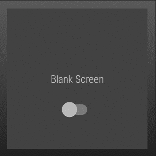

# AndroidWear

      
A repository that summaries Android Wear skills in Kotlin

## Contents
**#1 [BasicWearApp](https://github.com/SyamSundarKirubakaran/AndroidWear/tree/master/BasicWearApp)**
  

## 1. Basic Wear App:
A wear app that displays and illustrates the basics of switching from one background to a blank backgroung and vice versa 

**You'll Learn:**
* To create Android Wear App
* Switching background 

**Show case:**
 

  

